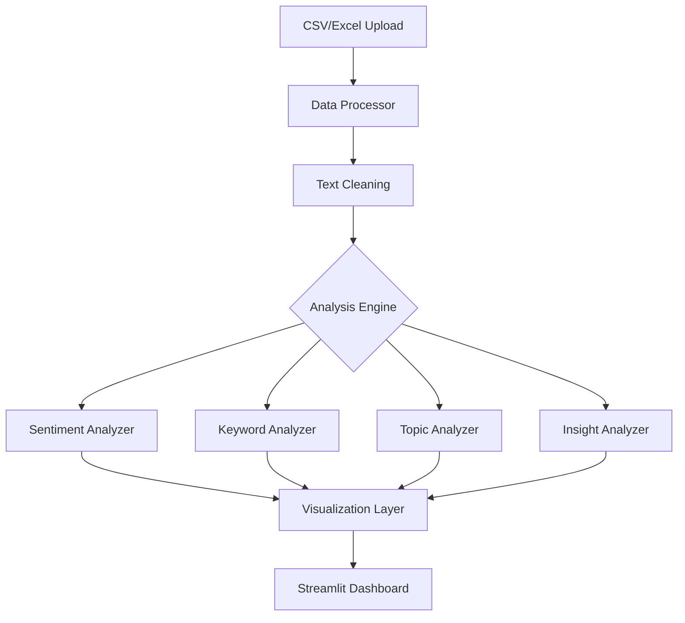

<div align="center">
  
  <h1>CustomerInsight</h1>
  <p>AI-powered customer review analysis platform</p>

  <a href="https://www.python.org/"></a>
  <a href="https://github.com/ChanMeng666/customer-insight/blob/main/LICENSE"></a>
  <a href="https://github.com/ChanMeng666/customer-insight/stargazers"></a>
</div>

<br>

<p align="center">
  <a href="https://chanmeng666-customerinsight-app-oeiu2h.streamlit.app/"><strong>Live Demo →</strong></a>
</p>

---

## Overview

CustomerInsight is an interactive analytics platform that uses NLP and machine learning to extract actionable insights from customer reviews. Built with Streamlit, it provides real-time sentiment analysis, keyword extraction, topic modeling, and anomaly detection — optimized for both Chinese and English text.

<div align="center">
  
</div>

## Features

- **Sentiment Analysis** — BERT-based sentiment classification with confidence scores. Uses `roberta-base-finetuned-jd-binary-chinese` for Chinese and `bert-base-multilingual-uncased-sentiment` for English.
- **Keyword Extraction** — TF-IDF keyword extraction with word cloud visualization, trend analysis, and rating-based comparison.
- **Topic Modeling** — LDA and K-Means clustering with topic network graphs, heatmaps, and trend tracking.
- **Anomaly Detection** — Isolation Forest-based outlier detection with multi-feature analysis (rating, text length, sentiment).
- **Interactive Filtering** — Filter by date range, rating, text length, and keywords with real-time updates.
- **Data Export** — Download filtered data and analysis results as CSV.

## Quick Start

```bash
# Clone the repository
git clone https://github.com/ChanMeng666/customer-insight.git
cd customer-insight

# Install dependencies
pip install -r requirements.txt

# Run the application
streamlit run app.py
```

Then open http://localhost:8501 and upload the sample dataset from `data/example_dataset.csv`.

## Data Format

| Column | Type | Required | Description |
|--------|------|----------|-------------|
| `timestamp` | datetime | Yes | Review timestamp |
| `content` | string | Yes | Review text |
| `rating` | float | No | Rating (1-5 scale) |
| `category` | string | No | Review category |
| `user_id` | string | No | User identifier |

## Architecture


```mermaid
graph TD
    A[CSV/Excel Upload] --> B[Data Processor]
    B --> C[Text Cleaning]
    C --> D{Analysis Engine}
    D --> E[Sentiment Analyzer]
    D --> F[Keyword Analyzer]
    D --> G[Topic Analyzer]
    D --> H[Insight Analyzer]
    E --> I[Visualization Layer]
    F --> I
    G --> I
    H --> I
    I --> J[Streamlit Dashboard]
```

## Tech Stack

**Framework**: Streamlit · **Language**: Python 3.9+

**NLP & ML**: Transformers · PyTorch · jieba · NLTK · scikit-learn · Sentence Transformers

**Visualization**: Plotly · Matplotlib · WordCloud · NetworkX

**Data**: Pandas · NumPy · SciPy

## Contributing

See [CONTRIBUTING.md](CONTRIBUTING.md) for the development guide.

## License

[MIT](LICENSE) © [Chan Meng](https://github.com/ChanMeng666)
